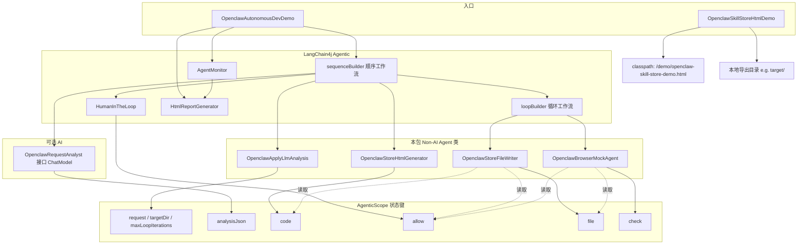
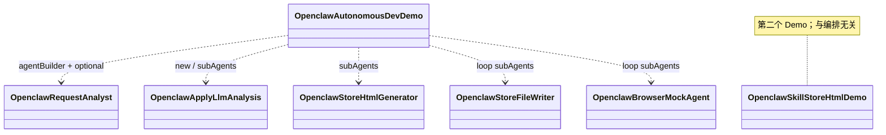

# uai-example · Demo 说明

本模块在 `com.uni.uai.demo.agent` 下提供两个与「Openclaw Skill 线上商店」评估场景相关的 Demo：

1. **AI 自主开发系统 Demo**（LangChain4j Agentic 流水线，以 Non-AI Agent 与 mock 为主）
2. **Openclaw Skill 线上商店单页静态 Demo**（独立 HTML + 导出脚本）

---

## 整体设计思路

本 Demo 用 **LangChain4j Agentic** 搭了一条「类 CI/CD + 人工门禁」的迷你流水线，模拟实现一个简单的 **「AI 自主开发系统」**：机器侧步骤尽量 **确定性、可重复**（省 token、易演示），人在环上只做一个 **高风险操作确认**（是否写磁盘）。

- **共享状态（AgenticScope）**：用字符串键在各步之间传递产物与决策，例如 `request` / `targetDir` 作为输入，`code`（HTML 源码）、`allow`（是否同意写入）、`file`（落盘路径）、`check`（mock 浏览器结论）作为中间与结束信号；若启用需求解析，还会经过 **`analysisJson`**（LLM  Raw JSON）与 **`maxLoopIterations`**（循环上限，可被解析结果覆盖）。
- **编排形态**：顶层 **顺序**（**可选** LLM 需求解析 → **合并解析结果** → 模板生成 HTML → 征得同意 → **循环**）；循环内 **顺序**（先写文件再 mock 校验）。可选解析参照 **`TestOptional`**：`OpenclawRequestAnalyst` 标记 `optional(true)`，仅当入参中包含 **`rawUserRequest`** 时才执行，否则会跳过（与缺少 `audience` 时跳过 `AudienceEditor` 同理）。
- **循环退出**：`check` 为 `success` / `user_declined` 时结束；或 **`loopCounter` 达到 `maxLoopIterations`**（默认 `10`，可被 LLM 解析覆盖并夹在 `[3,50]`，`loopBuilder.maxIterations(100)` 仅作框架硬上限）。
- **可观测性**：`AgentMonitor` 挂在外层顺序 Agent 上，记录调用树；结束后用 `HtmlReportGenerator` 落一份 HTML，可展示「不是黑盒脚本，而是可观测的 Agent 拓扑与执行轨迹」。
- **与真实系统的差距（诚实边界）**：HTML 正文仍来自 **模板 mock**，「浏览器」为 **mock**；唯一可调 **真实 ChatModel** 的环节是可选的 **`OpenclawRequestAnalyst`**（解析需求）。把校验换成 headless / E2E、把生成换成 LLM，都属于替换实现而少改编排。

---

## Mock 与 LLM：本 Demo 里分别是什么

| 环节 | 是否 Mock | 是否使用 LLM 的返回 | 说明 |
|------|-------------|---------------------|------|
| **需求解析（可选）** | **否（调用真实 ChatModel）** | **是** | `OpenclawRequestAnalyst` 为 **AI Agent（接口）**，经 `AgenticServices.agentBuilder(...).chatModel(ChatModelFactory…)` 绑定模型；仅当入参含 **`rawUserRequest`** 时执行（`optional(true)`）。模型须输出仅含 `pageTitle`、`maxLoopIterations` 的 JSON 字符串，写入 **`analysisJson`**。 |
| **合并解析结果** | **否（本地正则解析）** | **间接使用** | `OpenclawApplyLlmAnalysis` 为 **Non-AI**，读取 **`analysisJson`**，解析后覆盖 **`request`**（网页标题），并向 scope **`writeState("maxLoopIterations", …)`**；不再次调用模型。 |
| 商店 HTML 正文 | **是（模板 Mock）** | **否** | `OpenclawStoreHtmlGenerator` 用固定模板 + `request` 标题拼页面，无 `ChatModel`。 |
| 写入磁盘 | **否（真实 I/O）** | **否** | `OpenclawStoreFileWriter` 在用户同意后用 `java.nio.file` 真实写入。 |
| 「浏览器」加载与校验 | **是（Mock）** | **否** | `OpenclawBrowserMockAgent` 仅读本地文件，用 **调用次数 + `maxLoopIterations`** 动态决定何时成功（不再固定第 3 次）。 |
| 是否同意写入 | **否（真人输入）** | **否** | `HumanInTheLoop` 从 **标准输入** 读 `yes`/`no`。 |
| LangChain4j 编排与监控 | 框架能力 | **否** | 编排本身不调模型；**唯一绑定 LLM 的子 Agent 即上述 `OpenclawRequestAnalyst`**。 |

**一句话**：当前默认是 **开启 LLM 解析**（无参运行也会注入默认 `rawUserRequest`）；仅在可选 Analyst 这一步走 `ChatModel`，其余步骤仍为模板 / mock / I/O / stdin。

---

## `com.uni.uai.demo.agent` 包内每个类的作用

| 类 | 作用 |
|----|------|
| **`OpenclawAutonomousDevDemo`** | **入口与编排**：解析命令行（是否 **`analyserequest`**）；组装 **`OpenclawRequestAnalyst`（可选 AI）**、`OpenclawApplyLlmAnalysis`、`OpenclawStoreHtmlGenerator`、`HumanInTheLoop`、**循环**子工作流；注册 `AgentMonitor`；`invoke` 后生成 `openclaw-autodev-report.html`。 |
| **`OpenclawRequestAnalyst`** | **AI Agent（接口，`optional(true)`）**：对大模型发起调用，将自然语言摘要为 JSON（`pageTitle`、`maxLoopIterations`），输出键 **`analysisJson`**；入参缺 **`rawUserRequest`** 时整步跳过（对齐 **`TestOptional`**）。 |
| **`OpenclawApplyLlmAnalysis`** | **Non-AI Agent（类）**：读取 **`analysisJson`**（可为空）；解析 JSON，写入 **`request`**（网页标题）并通过 **`AgenticScope.writeState`** 写入 **`maxLoopIterations`**；无模型调用。 |
| **`OpenclawStoreHtmlGenerator`** | **Non-AI Agent（类）**：根据 **`request`** 生成单页商店 HTML（模板 mock），结果写入 **`code`**。 |
| **`OpenclawStoreFileWriter`** | **Non-AI Agent（类）**：读 **`allow`** / **`code`** / **`targetDir`**；仅在同意时写入 `openclaw-skill-store-generated.html`，路径写入 **`file`**。 |
| **`OpenclawBrowserMockAgent`** | **Non-AI Agent（类）**：mock「浏览器」；读 **`file`**；第 1、2 次调用返回错误文案，第 3 次 **`success`**，写入 **`check`**；`main` 调 **`resetInvocationCounterForDemo()`**。 |
| **`OpenclawSkillStoreHtmlDemo`** | **独立入口**：与 Agent 流水线无关；复制 classpath 静态 HTML 到本地（默认 `target/`）。 |

**关联资源（非 Java 类）**：`src/main/resources/demo/openclaw-skill-store-demo.html` — 预置的单页商店静态页，由 `OpenclawSkillStoreHtmlDemo` 导出。

---

## 类之间依赖关系（示意）

以下为 **逻辑依赖 / 编排关系**（非 Maven 模块依赖）。框架类型 `HumanInTheLoop`、`UntypedAgent`、`AgentMonitor`、`HtmlReportGenerator` 来自 **LangChain4j agentic**，在图中单独标出。



**Java 编译期依赖**：`OpenclawAutonomousDevDemo` 依赖 **`OpenclawRequestAnalyst`（接口 + langchain4j `ChatModelFactory`）**、三个 Non-AI 类实例及 LangChain4j；各 `@Agent` 业务类 **互不 import**；`OpenclawSkillStoreHtmlDemo` 独立。



**读图要点**：

- **`OpenclawAutonomousDevDemo`** 组装 **SEQ（Analyst → Merge → 生成 → HITL → LOOP）** + **MON + REP**；Analyst 为 **可选**（无 `rawUserRequest` 则跳过）。
- **`OpenclawSkillStoreHtmlDemo`** 与左侧流水线 **并行、独立**。
- **状态键**：`analysisJson` 仅在有 Analyst 时出现；`maxLoopIterations` 可由 **`OpenclawApplyLlmAnalysis`** 写入；其余同前。

---

## 环境要求

- JDK 17+（与父工程一致）
- Maven 3.9+
- 运行自主开发流水线时，控制台需能读取标准输入（同意写入目录时输入 `yes` / `no`）
- **`analyserequest=true` 时**：需能访问 **`ChatModelFactory` 配置的 LLM 端点**（默认与示例模块一致，见 `ChatModelFactory`），否则 Analyst 调用会失败

> 说明：Non-AI Agent 以 **类实例** 形式参与 `sequenceBuilder` / `loopBuilder`（与 `com.uni.uai.example.nonagent` 中 `ExchangeOperator` 用法一致）。**可选 AI Agent** 使用 **`agentBuilder(接口).chatModel(...)`**，参照 **`TestOptional`** 的 **`optional(true)`** 行为。

## Demo 1：`OpenclawAutonomousDevDemo`

模拟「**可选：LLM 解析需求** → 合并默认值 → 生成商店 HTML → 工程师确认是否落盘 → 写入磁盘 → mock 浏览器校验 → **循环直至 `check=success` 或达到 `maxLoopIterations`**」，并集成 `AgentMonitor` + `HtmlReportGenerator`（与 `TestAgentMonitor` 相同思路）。

### 命令行约定与操作流程

1. **关闭 LLM 解析（显式 `false`，省 token、离线可跑）**  
   - 与旧版一致：`目标目录` + 可选 `页面标题`（作为 **`request`**，直接用作网页标题）。  
   - 入参 **不** 包含 `rawUserRequest`，可选 **`OpenclawRequestAnalyst`** 被跳过。

2. **开启 LLM 解析（默认即开启，或显式 `analyserequest=true`）**  
   - 第一个参数必须为字面量 **`true`** 或 **`false`**。  
   - 为 **`true`** 时：入口会把随后的「用户描述」同时作为 **`rawUserRequest`**（触发 Analyst）和初始 **`request`**；Analyst 返回的 JSON 经 **`OpenclawApplyLlmAnalysis`** 覆盖 **`request`（标题）** 与 **`maxLoopIterations`**。  
   - 建议描述里包含期望的商店氛围；**`maxLoopIterations` 建议 ≥ 3**，以便 mock 浏览器第三次返回 `success`。

### 运行示例

在项目根目录 `uai-example` 下：

```bash
mvn -q compile -DskipTests
mvn -q dependency:build-classpath -Dmdep.outputFile=cp.txt
```

**无参启动（默认调用 LLM，使用内置用户描述）**：

```bash
java -cp "target/classes:$(cat cp.txt)" com.uni.uai.demo.agent.OpenclawAutonomousDevDemo
```

**兼容旧参数（`[目标目录] [标题...]`，当前默认也会开启 LLM 解析）**：

```bash
java -cp "target/classes:$(cat cp.txt)" com.uni.uai.demo.agent.OpenclawAutonomousDevDemo [目标目录] [页面标题...]
```

**新参数（首项为 `true`/`false` 即启用新约定）**：

```bash
# 使用 LLM 解析自然语言需求（需网络可达模型端点）
java -cp "target/classes:$(cat cp.txt)" com.uni.uai.demo.agent.OpenclawAutonomousDevDemo \
  true target/openclaw-demo-store \
  "做一个偏极客风格的 Openclaw 插件商店页，循环校验最多 8 轮"

# 显式关闭解析（与旧版等价，仅多写了 false）
java -cp "target/classes:$(cat cp.txt)" com.uni.uai.demo.agent.OpenclawAutonomousDevDemo \
  false target/openclaw-demo-store "我的固定标题"
```

参数小结：

| 模式 | 参数形式 | `rawUserRequest` | Analyst |
|------|-----------|------------------|---------|
| 显式关闭 | `false [目标目录] [标题…]` | 不注入 | 跳过 |
| 旧版兼容 | `[目标目录] [标题…]` | 注入（以标题原文注入） | 执行 |
| 新版 + LLM | `true [目标目录] [自然语言描述…]` | 注入 | 执行 |

运行时按提示输入 `yes` 同意写入，或 `no` 放弃（此时 mock 浏览器会将 `check` 置为 `user_declined` 并结束循环）。

### 产物

- 生成的 HTML：`{目标目录}/openclaw-skill-store-generated.html`
- Agent 调用可视化报告：当前工作目录下的 `openclaw-autodev-report.html`

流水线中框架组件 **`HumanInTheLoop`**（`outputKey=allow`）与 **`loopBuilder`** 子工作流（顺序「写入 → mock 浏览器」，直到 `check` 为 `success` 或 `user_declined`）的说明已并入上文表格与示意图。关键步骤会在控制台打印 `[OpenclawStore…]` / `[AgentStep]` 等日志。

## Demo 2：`OpenclawSkillStoreHtmlDemo`

将资源文件 `src/main/resources/demo/openclaw-skill-store-demo.html` 复制到本地目录（默认 `target/openclaw-skill-store-demo.html`），便于用浏览器 `file://` 打开或上传到静态托管，作为「部署上线」的最小静态站点示例。

### 运行

```bash
mvn -q compile -DskipTests
mvn -q dependency:build-classpath -Dmdep.outputFile=cp.txt
java -cp "target/classes:$(cat cp.txt)" com.uni.uai.demo.agent.OpenclawSkillStoreHtmlDemo [导出目录]
```

`导出目录` 可选，默认为 `target`。

## 与 `com.uni.uai.example` 的关系

- Agentic API 用法可参考 `src/main/java/com/uni/uai/example/agent/TestAgentMonitor.java`（监控与 HTML 报告）。
- **可选 Agent** 可参考 `src/main/java/com/uni/uai/example/agent/TestOptional.java`（`optional(true)` 与缺参跳过）。
- Non-AI Agent 可参考 `src/main/java/com/uni/uai/example/nonagent/ExchangeOperator.java`（类 + `@Agent` + `outputKey`）。
- LLM 模型实例来自 `com.uni.uai.example.llm.ChatModelFactory`（与示例模块共用配置）。
