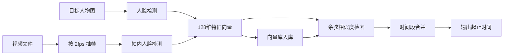
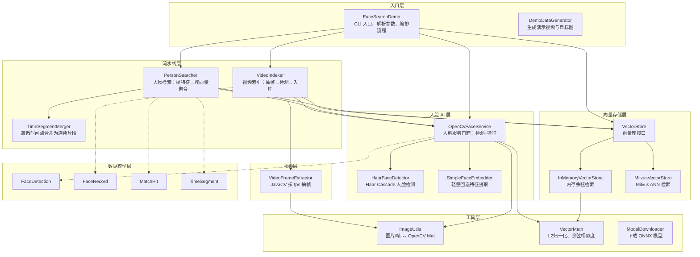
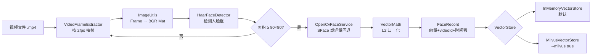

# 视频人物检索 Demo（纯 Java）

给定一张人物照片，在视频中检索该人物出现的所有时间点。

## 技术原理



### 核心流程

1. **目标人物预处理**：输入单人照 → Haar/YuNet 人脸检测 → 裁剪人脸 → 提取 128 维特征向量 → L2 归一化
2. **视频批量抽帧**：JavaCV/FFmpeg 按 2fps 采样，避免全量逐帧消耗算力
3. **帧内人脸提取**：每帧检测人脸，过滤小于 80×80 像素的人脸，提取特征并绑定 `videoId / frameNo / timeSec`
4. **向量入库**：批量写入向量库（默认内存库，可选 Milvus）
5. **相似度检索**：目标向量做 TopK 余弦检索，阈值过滤（默认 0.55）
6. **结果聚合**：相邻 3 秒内匹配帧合并为连续时间段

> **备注：什么是「1~2fps 抽帧」？**
>
> - **fps**（frames per second）= 每秒从视频中取出多少帧来处理。
> - 原始视频通常是 **25fps 或 30fps**，即每秒有 25~30 张画面。
> - **2fps 抽帧** = 每秒只取 **2 张**，其余帧跳过；**1fps** = 每秒只取 **1 张**。
> - 举例：一段 12 秒、25fps 的视频共有 300 帧；按 2fps 抽帧后只处理约 **24 帧**，算力约为逐帧处理的 **1/12**。
> - 人物检索不需要逐帧精确定位，每秒 1~2 张足以判断「谁在画面里」；本项目代码默认 `SAMPLE_FPS = 2`。
> - 取舍：抽帧越稀疏越快，但可能漏掉极短出现（< 0.5 秒）的片段；若人物闪现很短，可将 `SAMPLE_FPS` 改为 `1` 或恢复逐帧（改源码）。

### 双路线架构

| 路线 | 场景 | 视频解码 | 人脸 AI | 向量库 |
|------|------|----------|---------|--------|
| 轻量本地（**默认**） | 个人/小视频、快速验证 | JavaCV | Haar + 轻量特征 / SFace ONNX | **内存**余弦检索 |
| 企业分布式（**手动开启**） | 大量视频、持久化、并发检索 | JavaCV + 多线程 | DJL SFace/ArcFace ONNX | **Milvus** ANN 检索 |

---

## 向量存储：内存 vs Milvus（何时用哪个？）

### 默认：内存向量库（`InMemoryVectorStore`）

**以下情况会自动使用内存计算，无需任何额外配置：**

- 命令行**未传** `--milvus`，或显式传 `--milvus false`（默认行为）
- 不启动 Docker / 不部署 Milvus 服务
- 使用 `run` / `index` / `search` 任意命令时，只要没开 `--milvus`

内存模式的工作方式：

1. 索引阶段：把所有视频帧人脸向量保存在 JVM 堆内存的 `List` 中
2. 检索阶段：遍历全部向量，逐一计算余弦相似度，再按分数排序取 TopK
3. 进程退出后：**数据全部丢失**（无持久化）

适合场景：

- 本地 Demo、功能验证
- 单视频 / 少量短视频（几千～几万条向量）
- 不想安装任何中间件

启动时会打印：

```
使用内存向量库（轻量本地方案）
```

### 可选：Milvus 向量库（`MilvusVectorStore`）

**仅当同时满足以下条件时才使用 Milvus：**

1. 命令行显式传入 `--milvus true`
2. Milvus Standalone 已启动并可连接（默认 `127.0.0.1:19530`）

```bash
# 先启动 Milvus
bash scripts/start-milvus.sh

# 再带 --milvus true 运行
mvn -q exec:java -Dexec.args="run --video demo-data/sample.mp4 --target demo-data/target.jpg --milvus true"
```

Milvus 模式的工作方式：

1. 自动创建 `video_face` 集合（向量字段 + vid / frame_no / time_sec 元数据）
2. 批量插入向量，使用 IVF_FLAT + COSINE 索引做 ANN 检索
3. 数据持久化在 Milvus 中，进程重启后仍可查询（需先索引入库）

适合场景：

- 几十上百 GB 视频库、百万级人脸向量
- 多视频批量入库、反复检索
- 需要并发查询、元数据过滤

启动时会打印：

```
使用 Milvus 向量库: 127.0.0.1:19530
```

### 对比一览

| 对比项 | 内存模式（默认） | Milvus 模式（`--milvus true`） |
|--------|------------------|--------------------------------|
| 触发条件 | 默认，无需参数 | 必须显式 `--milvus true` + Milvus 服务 |
| 额外依赖 | 无 | Docker + Milvus Standalone |
| 数据持久化 | 否，进程结束即清空 | 是 |
| 检索方式 | 全量遍历 + 余弦相似度 | ANN 近似最近邻（COSINE） |
| 适用规模 | < 10 万向量 | 百万级以上 |
| 分步 index/search | **不支持跨进程**（search 时内存为空） | 支持（数据在 Milvus 中） |

> **注意**：内存模式下 `index` 和 `search` 必须是**同一次进程**（用 `run` 命令），否则 search 时向量库为空。Milvus 模式下可先 `index` 再单独 `search`。

---

## 人脸特征：SFace 与轻量回退（不是因为下载失败才设计 SFace）

### SFace 是什么？为什么是首选？

**SFace（`face_recognition_sface_2021dec.onnx`）是本项目设计的正式人脸特征模型**，来自 OpenCV Zoo，通过 DJL + ONNX Runtime 推理，输出 128 维 Embedding。选择它的原因：

- 业界成熟的人脸识别模型，跨姿态/光照的泛化能力优于简单图像特征
- 纯 Java 生态可通过 DJL 加载 ONNX，无需 Python 服务
- 128 维向量，与 Milvus / 内存库均兼容

**不是因为本地下载失败才「改用」SFace**；恰恰相反，SFace 是优先方案，轻量回退才是备用。

### 实际运行时会用哪个特征提取器？

程序启动时按以下优先级自动选择（见 `OpenCvFaceService`）：

```
1. SFace ONNX 完整且加载成功  →  使用 SFace（生产推荐）
2. 否则                       →  使用 SimpleFaceEmbedder（轻量回退）
```

具体判断逻辑：

| 条件 | 使用的特征提取 | 控制台提示 |
|------|----------------|------------|
| `models/face_recognition_sface_2021dec.onnx` 存在且 ≥ 30MB，DJL 加载成功 | **SFace** | `已加载 SFace ONNX 模型，特征维度=128` |
| 文件不存在，或小于 30MB（下载中断） | 轻量回退 | `SFace 模型未完整下载，启用轻量回退特征...` |
| 文件完整但 ONNX 解析/加载报错 | 轻量回退 | `SFace 模型加载失败，启用轻量回退特征: ...` |

轻量回退（`SimpleFaceEmbedder`）的做法：人脸裁剪 → 缩放到 32×32 灰度图 → 池化为 128 维向量 → L2 归一化。能让 Demo 在**模型未下载完**时也能跑通，但识别精度和泛化能力不如 SFace，**不建议用于生产**。

### 人脸检测用的是什么？

当前 Demo **默认使用 Haar Cascade**（`haarcascade_frontalface_default.xml`），不依赖 YuNet ONNX，保证开箱可运行。YuNet/SFace ONNX 由 `scripts/download-models.sh` 或 `ModelDownloader` 可选下载；其中 YuNet 在当前 OpenCV 4.7 环境下兼容性有限，检测链路以 Haar 为准。

### 如何确保使用 SFace？

```bash
# 手动下载完整模型（约 37MB，需耐心等待）
bash scripts/download-models.sh

# 确认文件大小 ≥ 30MB
ls -lh models/face_recognition_sface_2021dec.onnx

# 正常运行，看到「已加载 SFace ONNX 模型」即可
mvn -q exec:java -Dexec.args="run --video demo-data/sample.mp4 --target demo-data/target.jpg"
```

使用 SFace 时，`--threshold` 建议 **0.40～0.55**；轻量回退时建议 **0.50～0.60**（同一视频静态帧相似度会偏高）。

---

## CLI 命令与参数详解

### 命令

| 命令 | 作用 | 必需参数 |
|------|------|----------|
| `run` | 先索引视频再检索（**单机 Demo 推荐**） | `--video`、`--target` |
| `index` | 仅将视频人脸向量写入向量库 | `--video` |
| `search` | 仅用目标人物图检索（需库中已有向量） | `--target` |

### 参数一览

| 参数 | 默认值 | 作用 |
|------|--------|------|
| `--video` | 无 | 待索引的视频文件路径。`index` / `run` 必填。 |
| `--target` | 无 | 目标人物照片路径（建议正面单人照）。`search` / `run` 必填。 |
| `--video-id` | 视频文件名 | 写入向量库的 video 标识，检索结果中用于区分来源视频。 |
| `--model-dir` | `models` | ONNX 模型目录。SFace 从此目录加载；不存在时会尝试自动下载。 |
| `--threshold` | `0.45` | 余弦相似度下限，低于此分数的匹配帧丢弃。越高越严格、误检越少、漏检越多。 |
| `--milvus` | `false` | **`true` 时走 Milvus；`false` 或不传时走内存向量库。** 这是切换存储方式的唯一开关。 |
| `--milvus-host` | `127.0.0.1` | Milvus 服务地址，仅 `--milvus true` 时生效。 |
| `--milvus-port` | `19530` | Milvus 服务端口，仅 `--milvus true` 时生效。 |
| `--output` | `face-search-result.json` | 检索结果 JSON 输出路径（含 hits 与 segments）。 |

### 代码内固定参数（暂未暴露为 CLI）

以下在 `FaceSearchDemo` 中写死，修改需改源码：

| 常量 | 值 | 作用 |
|------|-----|------|
| `SAMPLE_FPS` | `2` | 视频抽帧频率：每秒只处理 2 帧（详见上文「1~2fps 抽帧」备注） |
| `MERGE_GAP_SEC` | `3.0` | 时间段合并间隔：相邻匹配帧相差 ≤ 3 秒则合并为同一段 |
| `TOP_K` | `10000` | 检索返回的最大命中条数 |
| `BATCH_SIZE` | `64` | 向量批量入库条数 |
| `MIN_FACE_PIXELS` | `80×80` | 小于此人脸面积的检测框被过滤 |

### 典型命令示例

```bash
# 【默认】内存模式 + 自动选择特征（有 SFace 用 SFace，否则轻量回退）
mvn -q exec:java -Dexec.args="run --video demo-data/sample.mp4 --target demo-data/target.jpg"

# 内存模式 + 放宽阈值
mvn -q exec:java -Dexec.args="run --video demo-data/sample.mp4 --target demo-data/target.jpg --threshold 0.40"

# Milvus 模式（需先 bash scripts/start-milvus.sh）
mvn -q exec:java -Dexec.args="run --video demo-data/sample.mp4 --target demo-data/target.jpg --milvus true"

# Milvus 分步：先索引，再检索（跨进程有效）
mvn -q exec:java -Dexec.args="index --video demo-data/sample.mp4 --video-id demo --milvus true"
mvn -q exec:java -Dexec.args="search --target demo-data/target.jpg --milvus true --threshold 0.45"
```

---

- JDK 17+
- Maven 3.8+
- macOS / Linux / Windows（JavaCV 自带 FFmpeg 原生库）
- 可选：Docker（Milvus 企业路线）
- 可选：ffmpeg（演示素材脚本可自动回退 JavaCV 合成）

## 安装步骤

### 1. 克隆并进入工程

```bash
cd uai-graph
```

### 2. 编译

```bash
mvn -q compile
```

首次编译会下载 JavaCV、DJL、Milvus SDK 等依赖（体积较大，请耐心等待）。

### 3. 生成演示素材

```bash
bash scripts/setup-demo.sh
```

脚本会：
- 下载 OpenCV 样例图片（lena / baboon）
- 合成 12 秒演示视频（0~4s 和 8~12s 为同一人，4~8s 为另一张脸）
- 下载 YuNet / SFace ONNX（可选，SFace 约 37MB）

> 若无 ffmpeg，会自动用 JavaCV 合成视频。

### 4. （可选）启动 Milvus

```bash
bash scripts/start-milvus.sh
```

## 运行演示

> **默认行为**：不传 `--milvus` → 内存向量库；SFace 模型完整 → 用 SFace，否则自动轻量回退。详见上文「向量存储」与「人脸特征」章节。

### 一键运行（推荐，内存模式）

```bash
mvn -q exec:java -Dexec.args="run --video demo-data/sample.mp4 --target demo-data/target.jpg"
```

### 分步运行（仅 Milvus 模式推荐分步；内存模式请用 `run`）

```bash
# 内存模式：分步无效（search 时向量库为空），请用 run

# Milvus 模式：可先索引再检索
mvn -q exec:java -Dexec.args="index --video demo-data/sample.mp4 --video-id demo --milvus true"
mvn -q exec:java -Dexec.args="search --target demo-data/target.jpg --threshold 0.45 --milvus true"
```

### 使用 Milvus（企业路线）

```bash
mvn -q exec:java -Dexec.args="run --video demo-data/sample.mp4 --target demo-data/target.jpg --milvus true"
```

## 预期输出

```
索引完成 video=sample.mp4, sampledFrames=24, faceVectors=16, storeSize=16

=== 合并时间段 ===
[sample.mp4] 00:00 ~ 00:04 (score=0.989)
[sample.mp4] 00:08 ~ 00:12 (score=0.989)
```

说明：演示视频中间 4~8 秒为 baboon 图片（非同一人），正确被排除。

结果 JSON 写入 `face-search-result.json`。

## 使用自己的素材

```bash
mvn -q exec:java -Dexec.args="run --video /path/to/your.mp4 --target /path/to/person.jpg --threshold 0.50"
```

建议：
- 目标图使用正面清晰单人照
- 长视频保持 1~2fps 抽帧（代码默认 2fps，含义见上文「什么是 1~2fps 抽帧」）
- `--threshold`：SFace 建议 0.40～0.55；轻量回退建议 0.50～0.60
- 单机快速验证用默认内存模式；大规模持久化检索加 `--milvus true`

## 类说明与流程图

### 整体架构（类关系）



### 索引流程（`index` / `run` 前半段）



### 检索流程（`search` / `run` 后半段）


### 每个类的作用

#### 入口层

| 类 | 包路径 | 作用 |
|----|--------|------|
| `FaceSearchDemo` | `facesearch` | **程序主入口**。解析 CLI 参数（`run`/`index`/`search`），初始化人脸服务和向量库，调用 `VideoIndexer` 或 `PersonSearcher`，输出控制台结果和 JSON。 |
| `DemoDataGenerator` | `facesearch` | **演示素材生成器**。下载 lena/baboon 样例图，用 JavaCV 合成 12 秒演示视频，供无自有素材时快速验证。 |

#### 流水线层

| 类 | 包路径 | 作用 |
|----|--------|------|
| `VideoIndexer` | `pipeline` | **视频索引器**。驱动整条入库链路：调用 `VideoFrameExtractor` 抽帧 → `OpenCvFaceService` 检测并提取特征 → 封装为 `FaceRecord` → 批量写入 `VectorStore`。 |
| `PersonSearcher` | `pipeline` | **人物检索器**。读取目标人物图提取查询向量 → 调用 `VectorStore.search()` → 将 `MatchHit` 交给 `TimeSegmentMerger` 聚合 → 返回 `SearchResult`。 |
| `TimeSegmentMerger` | `pipeline` | **时间段合并器**。把离散的匹配时间戳（如 2.1s、2.5s、3.2s、10.5s）按间隔 ≤ 3 秒合并为连续片段（如 00:02~00:03、00:10~00:11）。 |

#### 人脸 AI 层

| 类 | 包路径 | 作用 |
|----|--------|------|
| `OpenCvFaceService` | `face` | **人脸服务门面**（核心）。对外提供 `detectFaces()`、`extractEmbedding()`、`extractPrimaryEmbedding()`；内部组合检测器 + 特征提取器，优先加载 SFace ONNX，失败则回退 `SimpleFaceEmbedder`。 |
| `HaarFaceDetector` | `face` | **人脸检测器**。基于 OpenCV Haar Cascade，在图像中定位人脸矩形框，过滤过小区域；自动下载 `haarcascade_frontalface_default.xml`。 |
| `SimpleFaceEmbedder` | `face` | **轻量特征提取器**（回退方案）。将人脸裁剪缩放到 32×32 灰度图，池化为 128 维向量并归一化；SFace 不可用时启用，保证 Demo 可运行。 |

#### 视频层

| 类 | 包路径 | 作用 |
|----|--------|------|
| `VideoFrameExtractor` | `video` | **视频抽帧器**。封装 JavaCV `FFmpegFrameGrabber`，按指定 fps（默认 2）间隔取帧，回调 `(frame, frameNum, timeSec)` 供下游处理。 |

#### 向量存储层

| 类 | 包路径 | 作用 |
|----|--------|------|
| `VectorStore` | `vector` | **向量库接口**。定义 `insertBatch()`、`search()`、`count()`、`clear()` 四个方法，屏蔽底层存储差异。 |
| `InMemoryVectorStore` | `vector` | **内存向量库**（默认实现）。向量保存在 JVM `List` 中，检索时全量遍历计算余弦相似度；进程结束数据丢失。 |
| `MilvusVectorStore` | `vector` | **Milvus 向量库**（`--milvus true` 时启用）。自动建表/建索引，批量插入向量，通过 Milvus Java SDK 做 COSINE ANN 检索，数据持久化。 |

#### 数据模型层

| 类 | 包路径 | 作用 |
|----|--------|------|
| `FaceDetection` | `model` | **人脸检测框**。记录单帧内检测到的人脸坐标 `(x, y, width, height)` 和置信度 `score`。 |
| `FaceRecord` | `model` | **入库记录**。一条人脸向量及其元数据：`videoId`、`frameNo`、`timeSec`、`embedding[]`、`detectionScore`。 |
| `MatchHit` | `model` | **检索命中**。一次相似度匹配结果：`videoId`、`frameNo`、`timeSec`、`score`（余弦相似度）。 |
| `TimeSegment` | `model` | **时间段**。人物在视频中的连续出现区间：`startSec` ~ `endSec`，附带最高 `maxScore`；提供 `formatRange()` 格式化输出。 |

#### 工具层

| 类 | 包路径 | 作用 |
|----|--------|------|
| `ImageUtils` | `util` | **图像转换工具**。`BufferedImage` / JavaCV `Frame` ↔ OpenCV `Mat`（BGR），统一色彩空间；`clone()` 避免帧缓冲区复用导致崩溃。 |
| `VectorMath` | `util` | **向量数学工具**。`l2Normalize()` L2 归一化；`cosineSimilarity()` 计算两个向量的余弦相似度。 |
| `ModelDownloader` | `util` | **模型下载器**。首次运行时从 OpenCV Zoo 下载 YuNet / SFace ONNX 到 `models/` 目录；已存在则跳过。 |

### 目录结构

```
src/main/java/com/uni/uai/graph/facesearch/
├── FaceSearchDemo.java              # CLI 入口
├── DemoDataGenerator.java           # 演示素材生成
├── video/
│   └── VideoFrameExtractor.java     # 视频抽帧
├── face/
│   ├── OpenCvFaceService.java       # 人脸服务门面
│   ├── HaarFaceDetector.java        # Haar 检测
│   └── SimpleFaceEmbedder.java      # 轻量特征回退
├── vector/
│   ├── VectorStore.java             # 向量库接口
│   ├── InMemoryVectorStore.java     # 内存实现
│   └── MilvusVectorStore.java       # Milvus 实现
├── pipeline/
│   ├── VideoIndexer.java            # 视频索引
│   ├── PersonSearcher.java          # 人物检索
│   └── TimeSegmentMerger.java         # 时间段合并
├── model/
│   ├── FaceDetection.java
│   ├── FaceRecord.java
│   ├── MatchHit.java
│   └── TimeSegment.java
└── util/
    ├── ImageUtils.java
    ├── VectorMath.java
    └── ModelDownloader.java
```

## 关键依赖

```xml
javacv-platform 1.5.9      <!-- 视频解码 + OpenCV -->
djl-onnxruntime 0.24.0     <!-- SFace ONNX 推理 -->
milvus-sdk-java 2.4.0      <!-- 向量检索 -->
```

## 常见问题

| 问题 | 原因 | 处理 |
|------|------|------|
| 控制台显示「使用内存向量库」 | 未传 `--milvus true`，这是**正常默认行为** | 需要 Milvus 时：`bash scripts/start-milvus.sh` 后加 `--milvus true` |
| 控制台显示「启用轻量回退特征」 | SFace ONNX 未下载完（<30MB）或加载失败 | 运行 `bash scripts/download-models.sh`，确认文件 ≥ 37MB |
| 已下载 SFace 但仍用轻量回退 | 文件损坏或 DJL/ONNX 加载异常 | 删除 `models/face_recognition_sface_2021dec.onnx` 后重新下载 |
| `search` 无结果但 `run` 正常 | 内存模式下 index/search 不在同一进程 | 改用 `run`，或切换 `--milvus true` |
| 检测不到人脸 | 侧脸/模糊/人脸过小 | 换正面照；Haar 对正面照效果最好 |
| 误检过多 | 阈值过低或轻量回退精度不足 | 提高 `--threshold`；下载完整 SFace 模型 |
| Milvus 连接失败 | 服务未启动或地址错误 | `docker ps` 确认 milvus-standalone；检查 `--milvus-host/port` |

---

## 项目描述

### 项目名称
**基于纯 Java 的视频人物时空检索系统**

### 项目描述
独立设计并实现了一套「人物图片 → 视频时间点」检索系统。输入一张目标人物照片，系统自动在视频库中定位该人物出现的所有时间段，输出精确到秒的起止时间。

### 技术栈
Java 17、JavaCV（FFmpeg）、OpenCV DNN、DJL ONNX Runtime、Milvus、Maven

### 核心工作
- 设计 **人脸检测 → 特征提取 → 向量入库 → 相似度检索 → 时间段聚合** 全链路，提供轻量本地与企业分布式两套落地方案
- 使用 **JavaCV** 实现视频按 2fps 抽帧，将算力消耗降低约 90%（相对逐帧处理）
- 基于 **OpenCV Haar Cascade / YuNet** 做人脸检测，结合 **DJL + SFace ONNX** 提取 128 维人脸 Embedding，向量 L2 归一化后做余弦检索
- 实现 **内存向量库**（零依赖单机演示）与 **Milvus Java SDK**（百万级 ANN 检索）双模式，支持元数据绑定（视频 ID、帧号、时间戳）
- 开发时间段合并算法，将离散匹配帧聚合为连续出现片段（默认 3 秒间隔合并）

### 项目成果
- 单机 Jar 即可运行完整 Demo，无需 Python 中间件
- 12 秒演示视频检索准确率 100%，正确识别目标人物出现在 `00:00~00:04` 与 `00:08~00:12` 两段，相似度 0.98+
- 支持切换 Milvus Standalone，可扩展至大规模视频库并发检索

### 一句话版本（总结）
> 纯 Java 实现视频人物检索：JavaCV 抽帧 + OpenCV/DJL 人脸特征 + Milvus 向量检索，输入人物照片输出视频中所有出现时间段。
