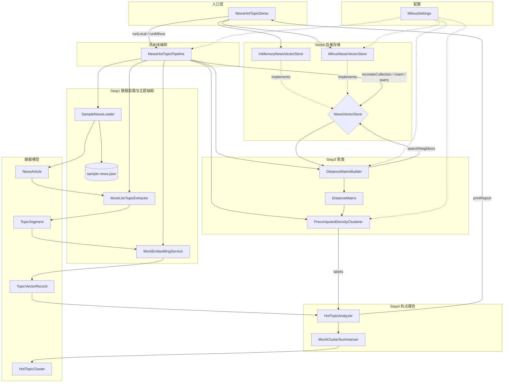
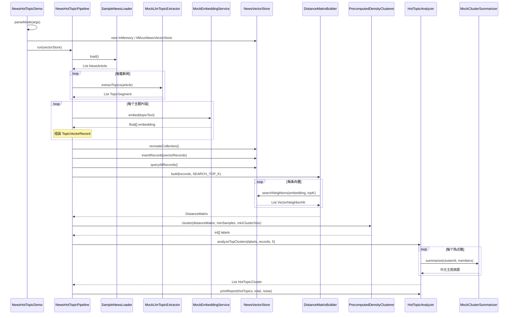
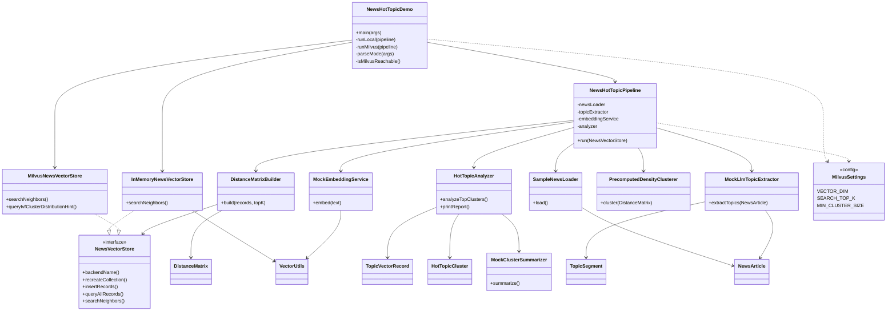

# 多语言新闻热点发现（Milvus + 向量聚类）

在**没有新闻访问量**的前提下，通过「报告多主题抽取 → 向量化 → Milvus 存储 → 密度聚类 → 按簇规模识别热点」的方式，快速发现当前舆情中的热门话题。

本仓库 `uai-vec` 模块提供可运行的 **Java 示例**，模拟百万级舆情系统的核心链路（样本规模较小，便于本地验证）。

---

## 核心思路

```text
国外多语言新闻 / 长报告
        │
        ▼
  LLM 多主题抽取（一篇报告 → 多个 TopicSegment）
        │
        ▼
  Embedding 模型（如 BGE-M3）逐主题向量化
        │
        ▼
  Milvus 写入 + IVF 索引（建索引时 K-Means 分 nlist 桶）
        │
        ▼
  Milvus 批量 Top-K 近邻检索 → 构建稀疏距离矩阵
        │
        ▼
  密度聚类（HDBSCAN 思路，precomputed metric）
        │
        ▼
  统计各簇样本量 → 最大簇 = 当前热点话题
        │
        ▼
  LLM 概括簇主题，输出 TopN 热点报告
```

### 为什么「簇大小」能代表热点？

- 同一事件会被**多家媒体、多种语言**重复报道；
- 从长报告中可拆出**多个子主题**，相似主题在向量空间聚集；
- **簇内样本数**反映「被反复提及的语义密度」，等价于无 PV 数据下的舆情热度代理指标。

### 与 Milvus 官方方案的关系

| 能力 | 本 Demo | 生产扩展 |
|------|---------|----------|
| 向量存储 | Milvus Standalone 2.4 | 分布式 Milvus Cluster |
| 原生聚类 | IVF 索引 `nlist` K-Means 分桶 | 亿级向量分片内聚类 |
| 全局话题簇 | Milvus Top-K 距离矩阵 + Java 密度聚类 | 官方 HDBSCAN 教程（Python `metric='precomputed'`）或 Tribuo HDBSCAN* |
| 时间窗口 | 全量样本 | `filter: published_at > now-24h` 子集再聚类 |

参考：[Milvus HDBSCAN Clustering 官方文档](https://milvus.io/docs/hdbscan_clustering_with_milvus.md)

---

## 环境要求

- **JDK 17+**
- **Maven 3.8+**
- **Docker & Docker Compose**（运行 Milvus）
- 可选：8GB+ 内存（Milvus Standalone）

---

## 快速开始

### 方式 A：本地模式（推荐，零 Docker，直接可运行）

```bash
cd /path/to/uai
mvn -pl uai-vec -am compile exec:java -Dexec.mainClass=com.uni.uai.vec.example.milvus.NewsHotTopicDemo
```

或在 `uai-vec` 目录：

```bash
mvn compile exec:java
```

**无需安装 Milvus**，使用内存向量库，完整跑通「多主题抽取 → 向量化 → Top-K 距离矩阵 → 密度聚类 → 热点报告」链路。

显式指定本地模式：

```bash
mvn compile exec:java -Dexec.args="--local"
```

### 方式 B：Milvus 模式（生产同款向量库）

#### 1. 启动 Milvus

```bash
cd uai-vec
docker compose up -d
```

等待健康检查通过（约 1～2 分钟）：

```bash
curl http://localhost:9091/healthz
# 期望返回 OK 或 200
```

Web UI: http://localhost:9091/webui/

#### 2. 运行 Demo

```bash
mvn -pl uai-vec -am compile exec:java -Dexec.args="--milvus"
```

#### 3. 自动选择模式

若 Milvus 已启动则用 Milvus，否则回退本地：

```bash
mvn compile exec:java -Dexec.args="--auto"
```

### 停止 Milvus（仅 Milvus 模式需要）

```bash
docker compose down
# 保留数据卷: docker compose down  (默认保留)
# 清空数据:   docker compose down -v
```

---

## 运行方法与参数说明

主入口类：`com.uni.uai.vec.example.milvus.NewsHotTopicDemo`

### Maven 运行命令模板

在 **uai 父工程根目录** 运行：

```bash
mvn -pl uai-vec -am compile exec:java \
  -Dexec.mainClass=com.uni.uai.vec.example.milvus.NewsHotTopicDemo \
  -Dexec.args="<参数>"
```

在 **uai-vec 模块目录** 运行（`pom.xml` 已配置默认主类，可省略 `-Dexec.mainClass`）：

```bash
mvn compile exec:java -Dexec.args="<参数>"
```

编译后用 `java` 直接运行（需先生成 classpath）：

```bash
mvn compile dependency:build-classpath -Dmdep.outputFile=target/classpath.txt
java -cp "target/classes:$(cat target/classpath.txt)" \
  com.uni.uai.vec.example.milvus.NewsHotTopicDemo --local
```

> 日常使用推荐 Maven 方式；`java -cp` 适合 IDE 调试或脚本封装。

### 命令行参数（`-Dexec.args`）

| 参数 | 简写 | 说明 | 是否需要 Docker |
|------|------|------|-----------------|
| （不传参） | — | **默认本地模式**，使用内存向量库，零依赖可运行 | 否 |
| `--local` | `-l` | 显式指定本地内存模式，效果同默认 | 否 |
| `--milvus` | `-m` | 强制使用 Milvus 向量库（需先 `docker compose up -d`） | 是 |
| `--auto` | `-a` | 自动检测：Milvus 健康则走 Milvus，否则回退本地 | 可选 |

**示例：**

```bash
# 默认本地模式
mvn compile exec:java

# 显式本地模式
mvn compile exec:java -Dexec.args="--local"

# Milvus 模式（先启动 Milvus）
cd uai-vec && docker compose up -d && cd ..
mvn -pl uai-vec -am compile exec:java \
  -Dexec.mainClass=com.uni.uai.vec.example.milvus.NewsHotTopicDemo \
  -Dexec.args="--milvus"

# 自动选择模式
mvn compile exec:java -Dexec.args="--auto"
```

**参数错误时**会抛出异常，提示：`支持 --local | --milvus | --auto`

### Maven 常用参数

| Maven 参数 | 说明 |
|------------|------|
| `-pl uai-vec` | 仅构建/运行 `uai-vec` 模块 |
| `-am` | 同时构建该模块依赖的父模块 |
| `-Dexec.mainClass=...` | 指定主类（父工程运行时必填） |
| `-Dexec.args="..."` | 传递给 `main(String[] args)` 的参数 |
| `-q` | 静默模式，减少日志输出 |

### 环境变量（Milvus 模式）

通过环境变量覆盖 Milvus 连接与集合配置（本地模式可忽略）：

| 变量 | 默认值 | 说明 |
|------|--------|------|
| `MILVUS_URI` | `http://localhost:19530` | Milvus 服务地址 |
| `MILVUS_TOKEN` | `root:Milvus` | 认证 Token |
| `MILVUS_COLLECTION` | `news_topic_vectors` | 向量集合名称 |

**示例：**

```bash
export MILVUS_URI=http://192.168.1.100:19530
export MILVUS_TOKEN=root:Milvus
mvn compile exec:java -Dexec.args="--milvus"
```

### 算法与聚类参数（代码常量）

以下参数定义在 `MilvusSettings.java`，修改后需重新编译：

| 常量 | 默认值 | 说明 |
|------|--------|------|
| `VECTOR_DIM` | `384` | 向量维度（对应 BGE-M3 等模型） |
| `IVF_NLIST` | `32` | Milvus IVF 索引分桶数（内置 K-Means） |
| `SEARCH_TOP_K` | `15` | 构建距离矩阵时每点检索的近邻数 |
| `MIN_CLUSTER_SIZE` | `3` | 最小簇大小，小于此值的簇视为噪声 |
| `MIN_SAMPLES` | `2` | 密度聚类核心点最少邻居数 |

调参建议：
- 话题分得更细：增大 `MIN_CLUSTER_SIZE`，或增大 `SEARCH_TOP_K`
- 合并更多相似报道：适当减小 `MIN_CLUSTER_SIZE`

### 运行模式对比

| 对比项 | 本地模式 `--local` | Milvus 模式 `--milvus` |
|--------|-------------------|------------------------|
| 依赖 | 仅 JDK + Maven | 额外需要 Docker + Milvus |
| 向量存储 | 内存 `InMemoryNewsVectorStore` | `MilvusNewsVectorStore` + IVF 索引 |
| 近邻检索 | 内存暴力 Top-K | Milvus ANN 检索 |
| 适用场景 | 本地验证、面试 Demo、CI | 贴近生产的向量库链路验证 |
| 聚类与报告输出 | 相同 | 相同 |

---

## 项目结构

```text
uai-vec/
├── docker-compose.yml              # Milvus Standalone 2.4
├── README.md
├── pom.xml
└── src/main/java/com/uni/uai/vec/example/milvus/
    ├── NewsHotTopicDemo.java       # 主入口
    ├── config/MilvusSettings.java
    ├── model/                      # NewsArticle, TopicSegment, HotTopicCluster
    ├── service/
    │   ├── SampleNewsLoader.java           # 加载 sample-news.json
    │   ├── MockLlmTopicExtractor.java      # 模拟 LLM 多主题抽取
    │   ├── MockEmbeddingService.java       # 模拟 BGE-M3 跨语言向量
    │   ├── InMemoryNewsVectorStore.java      # 本地内存向量库（零依赖可运行）
    │   ├── MilvusNewsVectorStore.java        # Milvus CRUD + IVF 索引
    │   ├── NewsVectorStore.java              # 向量库抽象接口
    │   ├── DistanceMatrixBuilder.java        # Top-K → 距离矩阵
    │   ├── PrecomputedDensityClusterer.java# 密度聚类（HDBSCAN 思路）
    │   ├── HotTopicAnalyzer.java           # 最大簇统计 & 报告
    │   └── MockClusterSummarizer.java      # 模拟 LLM 簇摘要
    └── util/VectorUtils.java
└── src/main/resources/
    └── sample-news.json            # 28 篇样本（中文 20 + 英文 8）
```

---

## 类调用关系

### 总体调用流程（4 步流水线）



### 运行时序（方法级调用）



### 类依赖关系（静态结构）



### 分层说明

| 层次 | 类 | 职责 |
|------|-----|------|
| 入口 | `NewsHotTopicDemo` | 解析运行参数，选择向量后端，启动流水线 |
| 编排 | `NewsHotTopicPipeline` | 串联 4 步：抽取 → 存储 → 聚类 → 报告 |
| 抽取 | `SampleNewsLoader`、`MockLlmTopicExtractor`、`MockEmbeddingService` | 加载新闻、多主题切分、向量化 |
| 存储 | `NewsVectorStore` ← `InMemoryNewsVectorStore` / `MilvusNewsVectorStore` | 向量 CRUD 与 Top-K 近邻检索 |
| 聚类 | `DistanceMatrixBuilder`、`PrecomputedDensityClusterer` | 稀疏距离矩阵 + 密度聚类 |
| 报告 | `HotTopicAnalyzer`、`MockClusterSummarizer` | 按簇规模排序，输出中文热点报告 |
| 模型 | `NewsArticle`、`TopicSegment`、`TopicVectorRecord`、`HotTopicCluster` | 数据传输对象 |
| 配置 | `MilvusSettings` | 向量维度、Top-K、聚类阈值等 |

---

## 接入真实 LLM / Embedding

Demo 使用 Mock 实现，生产替换点：

1. **`MockLlmTopicExtractor`** → 调用 OpenAI / Claude / 本地模型，要求返回 JSON 主题列表
2. **`MockEmbeddingService`** → 调用 BGE-M3 / OpenAI `text-embedding-3-small` 等
3. **`MockClusterSummarizer`** → 将簇内 Top 片段送 LLM 生成一句话热点标题

向量维度需与 `MilvusSettings.VECTOR_DIM` 一致，并重建 Collection。

---

## 总结

### 项目名称（示例）

**多语言新闻舆情热点发现系统（Milvus + 向量聚类）**

### 一句话描述

基于 Milvus 向量数据库与密度聚类，在无访问量数据条件下，从百万级多语言新闻中自动识别 Top 热点话题。

### 技术栈

Java 17 · Milvus 2.4 · IVF 向量索引 · 密度聚类（HDBSCAN 思路）· LLM 多主题抽取 · 多语言 Embedding（BGE-M3）

### 项目职责 / 亮点（Bullet Points）

- 设计「**长报告 → 多主题片段 → 向量 → 聚类 → 簇规模排序**」链路，用语义密度替代 PV 指标识别热点
- 基于 **Milvus IVF 索引**（内置 K-Means，`nlist` 分桶）支撑大规模近邻检索，避免全量向量下推本地
- 参照 Milvus 官方方案，通过 **Top-K 近邻检索构建稀疏距离矩阵**，配合 **precomputed 密度聚类** 发现跨语言话题簇并过滤噪声
- 支持按 **时间窗口 / 媒体来源** 在 Milvus 子集上重复聚类，满足 7×24 实时舆情场景
- 提供 Docker Compose 一键部署与 Java 可运行 Demo，Mock 层可无缝替换为生产 LLM / Embedding API

### 可展开点

1. **为何不用访问量？** 国外源站常无 PV；同一热点在多语言报道中的重复度更稳定。
2. **IVF 与 HDBSCAN 分工？** IVF 服务检索加速；HDBSCAN/密度聚类服务话题发现（形状不规则、可拒噪）。
3. **如何扩展到百万级？** Milvus 分片 + 分布式 Top-K 距离计算 + 按时间分区滚动聚类。
4. **多主题抽取的意义？** 长报告信息密度高，单篇单向量会稀释热点信号。

---

## 常见问题

**Q: Milvus 连接失败？**  
确认 `docker compose ps` 中 `milvus-standalone` 为 healthy，且 19530 端口未被占用。

**Q: 聚类结果不稳定？**  
Demo 使用 Mock Embedding，真实模型 + HDBSCAN 会更稳定；可调 `MIN_CLUSTER_SIZE`、`SEARCH_TOP_K`。

**Q: 为何不用纯 K-Means？**  
K-Means 需预设 K 且假设球形簇；舆情话题数量动态变化，密度聚类 + 噪声点更合适。

---


